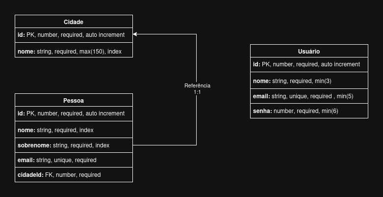

# API Rest - Node.js e TypeScript
Este projeto é uma API Rest, desenvolvida utilizando Node.js e TypeScript, para fins de aprendizado. O projeto tem como base o curso de **[API Rest em NodeJS e Typescript](https://youtu.be/SVepTuBK4V0)**, do canal **[Lucas Souza Dev](https://www.youtube.com/c/LucasSouzaDev)** no YouTube.

## Diagrama da aplicação
</img>

## Conceitos abordados no projeto
- Endpoints;
- Controllers;
- Banco de dados SQL;
- Query builder;
- Migrations de banco;
- Seeds de banco;
- Controle de usuário com email e senha;
- Criptografia de senha;
- Login de usuários;
- Geração e utilização de tokens JWT;
- Validação minuciosa de dados que entram nos endpoints;
- Paginação de consultas;
- Filtros de consultas;
- Testes de código para garantir qualidade das entregas;
- Uso de diferentes bancos de dados com um mesmo código;
- Boas práticas de código, com conceitos do clean code.

## Endpoints
### Cidades (Privado)
| Método | Endpoint | Descrição |
| --- | --- | --- |
| GET | `/cidades` | Busca uma lista de cidades, com paginação e filtro por nome |
| POST | `/cidades` | Criar uma nova cidade |
| GET | `/cidades/:id` | Busca apenas uma cidade através de seu id |
| PUT | `/cidades/:id` | Atualiza uma cidade pelo id |
| DELETE | `/cidades/:id` | Apaga a cidade pelo seu id |

### Pessoas (Privado)
| Método | Endpoint | Descrição |
| --- | --- | --- |
| GET | `/pessoas` | Busca uma lista de pessoas, com paginação e filtro por nome |
| POST | `/pessoas` | Criar uma nova pessoa |
| GET | `/pessoas/:id` | Busca apenas uma pessoa através de seu id |
| PUT | `/pessoas/:id` | Atualiza uma pessoa pelo id |
| DELETE | `/pessoas/:id` | Apaga a pessoa pelo seu id |

### Login (Público)
| Método | Endpoint | Descrição |
| --- | --- | --- |
| POST | `/entrar` | Permite um usuário existente no sistema gerar um token para acessar os endpoints privados |
| POST | `/cadastrar` | Permite criar um novo usuário |

#### Payload dos endpoints (Login):

- **Cadastrar usuário:** Cadastra um usuário no banco de dados do sistema.

  Endpoint: `/cadastrar`
  ```json
  {
    "nome": "Nome do usuário",
    "email": "Email do usuário",
    "senha": "Senha do usuário"
  }
  ```

- **Fazer login:** Gera um token JWT para o usuário utilizar os endpoints privados do sistema.

  Endpoint: `/entrar`
  ```json
  {
    "email": "Email do usuário",
    "senha": "Senha do usuário"
  }
  ```

## Como rodar o projeto
1. Clone o repositório na sua máquina:
    ```bash
    git clone https://github.com/jardsonalan/api-rest-node-typescript.git
    ```

2. Entre na pasta do projeto:
    ```bash
    cd api-rest-node-typescript
    ```

3. Instale as dependências:
    ```bash
    npm install
    ```

4. Configure as variáveis de ambiente:
    - Criando um arquivo `.env` com o conteúdo do arquivo `.env.example`;
    - Ou, com o seguinte conteúdo:
    
      ```
      PORT=3333
      NODE_ENV=dev

      IS_LOCALHOST=true

      ENABLED_CORS=[Lista de endereços separados por ";"]
      JWT_SECRET=[Uma string qualquer]
      ```

5. Rode o projeto, executando:
    ```bash
    npm run dev
    ```

## Contribuições
Contribuições são bem-vindas! Se você deseja melhorar este projeto ou corrigir algum problema, por favor:
1. Faça um **fork** deste repositório;
2. Crie uma **branch** com a sua feature ou correção: `git checkout -b minha-feature`;
3. Faça o **commit** das suas alterações: `git commit -m 'Minha nova feature'`;
4. Envie para o **repositório remoto**: `git push origin minha-feature`;
5. Abra um **Pull Request** explicando as alterações realizadas.

## Licença
Este projeto está licenciado sob a licença MIT. Consulte o arquivo **[LICENSE](./LICENSE)** para mais detalhes.
